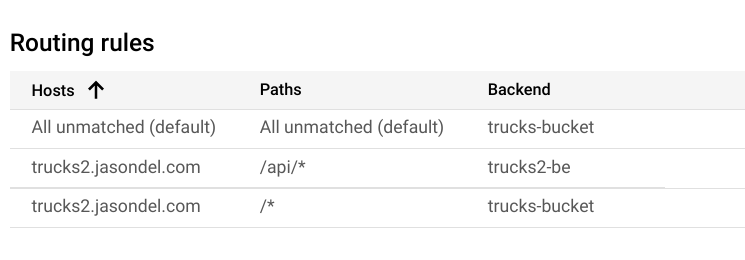
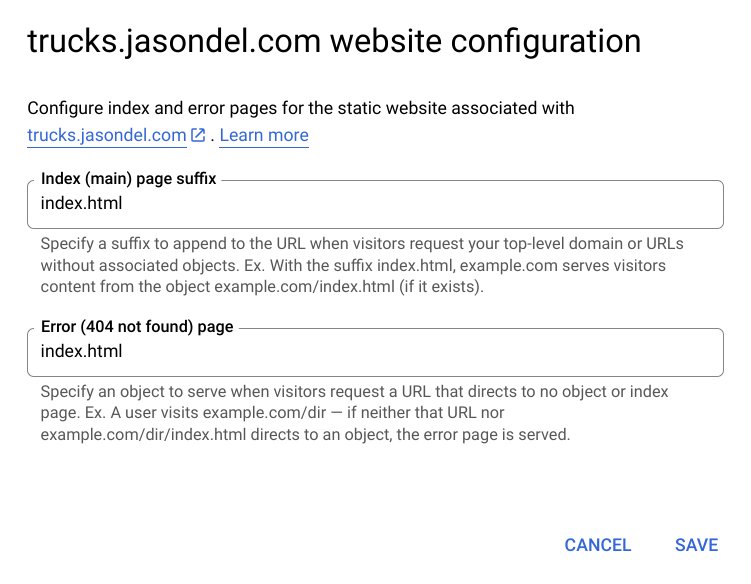

## build
To build the application which will increment the version and create a tag and deploy the application to the dist/trucks-web folder

```bash
npm run build
```

## deploy
To deploy the application to GCS storage bucket

```bash
npm run deploy
```

# Configure load balancer
Follow [these instructions](https://cloud.google.com/storage/docs/hosting-static-website) to serve the static web application from Google Cloud Storage.  

## Configure Routing
When configuring the load balancer, setup 2 backends:
* /* points to the storage bucket
* /api/* points to Cloud Run instance




## Storage Bucket Configruation
From the storage buckets page click **Edit Web Configuration** and set both default and 404 to index.html.  This will ensure that the load balancer will rewrite any request to /index.html and allow Angular's router to handle proper routing.    



If you do not do this, you will get a `KeyNotFound` error from the Load Balancer for any request that isn't in /api/* or the exact match of a file in the bucket.

